# Formal Safety Properties

The Lean 4 specification (`lean/MpfsCage/Spec.lean`) formalizes 16 safety property categories for the cage validators. These map 1-to-1 to the Aiken inline tests.

## Property Categories

| # | Property | Description |
|---|----------|-------------|
| 1 | Token uniqueness | `assetName` is deterministic and injective (SHA2-256 collision resistance) |
| 2 | Minting integrity | Referenced UTxO consumed, exactly 1 token minted, output to script with empty root |
| 3 | Ownership & authorization | Oracle ops require state owner signature, retract requires request owner signature |
| 4 | Token confinement | After Modify/Reject the token stays at the same script address |
| 5 | Ownership transfer | Owner field unchecked during Modify — current owner can transfer |
| 6 | State integrity (MPF root) | Output root equals fold of all request operations over input root |
| 7 | Proof consumption | Exactly one proof per matching request |
| 8 | Request binding | Contribute validates request's target token matches state UTxO |
| 9 | Datum-redeemer type safety | Each redeemer expects a specific datum constructor |
| 10 | Datum presence | Every cage UTxO must carry a datum |
| 11 | End/burn integrity | End requires mint field to contain exactly -1 of the caged token |
| 12 | Token extraction | `tokenFromValue` returns `Some` iff exactly one non-ADA policy with one asset |
| 13 | Time-gated phases | Phases are mutually exclusive — no validity range satisfies two phases |
| 14 | Reject (DDoS protection) | Owner signed, root unchanged, token confined, each request rejectable |
| 15 | Fee enforcement | Request fee must equal state's maxFee, requester refunded `input - fee` |
| 16 | Migration | Old token burned, new token minted, output to new script with StateDatum |

## Phase Model

```mermaid
gantt
    title Request Lifecycle Phases
    dateFormat X
    axisFormat %s

    section Phases
    Phase 1 - Oracle processing : 0, 10
    Phase 2 - Requester retract : 10, 20
    Phase 3 - Rejectable        : 20, 30
```

- **Phase 1** `[submittedAt, submittedAt + processTime)` — oracle-exclusive processing window
- **Phase 2** `[submittedAt + processTime, submittedAt + processTime + retractTime)` — requester-exclusive retract window
- **Phase 3** `≥ submittedAt + processTime + retractTime` — request is rejectable by oracle

Phases are proven mutually exclusive in Lean (`phase_exclusivity`, `phase2_reject_exclusive`).

## Composite Validator

The `validSpend` predicate combines all applicable properties per redeemer:

| Redeemer | Datum | Required Properties |
|----------|-------|---------------------|
| Retract | RequestDatum | request owner signed, in Phase 2 |
| Contribute | RequestDatum | request token matches state token |
| Modify | StateDatum | oracle signed, token confined, root integrity, fee enforced |
| Reject | StateDatum | oracle signed, token confined, root unchanged, requests rejectable |
| End | StateDatum | oracle signed, burn integrity (-1 token) |
