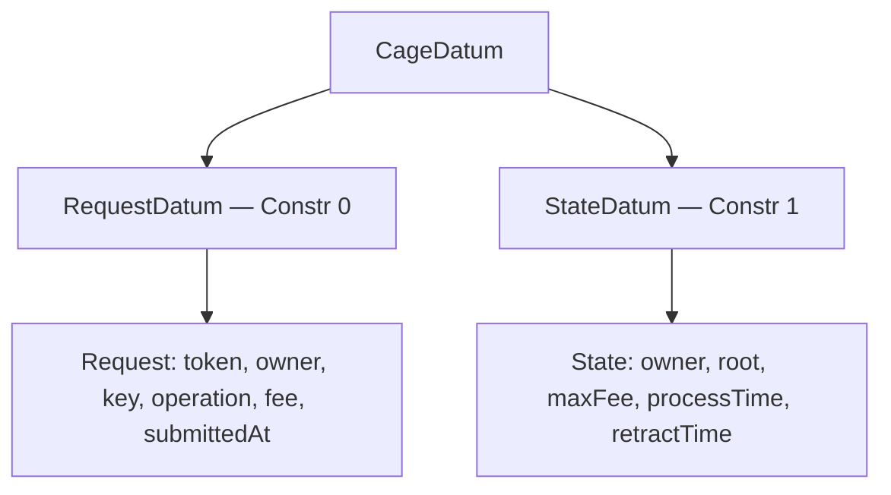

# On-chain Types

The Haskell library (`Cardano.MPFS.Cage.Types`) defines PlutusData types matching the Aiken on-chain datum/redeemer structures byte-for-byte.

All `ToData`/`FromData` instances are hand-written (not TH-derived) to guarantee constructor indices and field ordering match the Aiken source.

## Datum

### CageDatum

Discriminator for UTxOs at the script address.

- **RequestDatum** (Constr 0) — a pending modification request
- **StateDatum** (Constr 1) — current token state with MPF root

### State

| Field | Type | Description |
|-------|------|-------------|
| owner | VKH (28 bytes) | Payment key hash of the token owner |
| root | Hash | Current Merkle root (Blake2b-256) |
| maxFee | Integer | Maximum fee per request (lovelace) |
| processTime | Integer | Phase 1 duration (ms) |
| retractTime | Integer | Phase 2 duration (ms) |

### Request

| Field | Type | Description |
|-------|------|-------------|
| requestToken | TokenId | Target token's asset name |
| requestOwner | VKH (28 bytes) | Requester's payment key hash |
| requestKey | Bytes | Trie key to operate on |
| requestValue | Operation | Insert/Delete/Update |
| fee | Integer | Fee the requester agrees to pay |
| submittedAt | POSIXTime | When the request was submitted |

### Operation

- **Insert** (Constr 0) — new key-value pair
- **Delete** (Constr 1) — remove a key (carries old value for proof)
- **Update** (Constr 2) — replace old value with new value

## Redeemers

### MintRedeemer

- **Minting** (Constr 0) — mint a new cage token from an `OutputReference`
- **Migrating** (Constr 1) — migrate from an old validator policy
- **Burning** (Constr 2) — burn a cage token

### UpdateRedeemer (spending)

- **End** (Constr 0) — terminate the token
- **Contribute** (Constr 1) — link a request to a state UTxO
- **Modify** (Constr 2) — fold requests with Merkle proofs
- **Retract** (Constr 3) — reclaim a pending request
- **Reject** (Constr 4) — reject expired requests

## Asset Name Derivation

`SHA2-256(txId ++ bigEndian16(outputIndex))`

Implemented in `Cardano.MPFS.Cage.AssetName.deriveAssetName`, matching Aiken's `lib.assetName`.

## Proof Encoding

`Cardano.MPFS.Cage.Proof` serializes MPF proofs to the CBOR/PlutusData format expected by the Aiken validator. Steps are reversed from leaf-to-root to root-to-leaf order. The encoding uses indefinite-length CBOR lists and bytestrings to match the TypeScript reference byte-for-byte.
